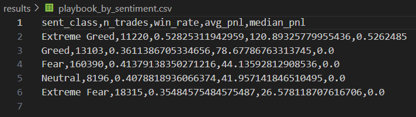
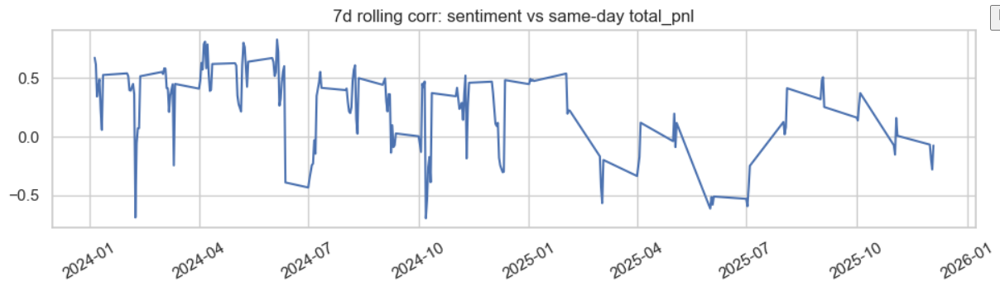
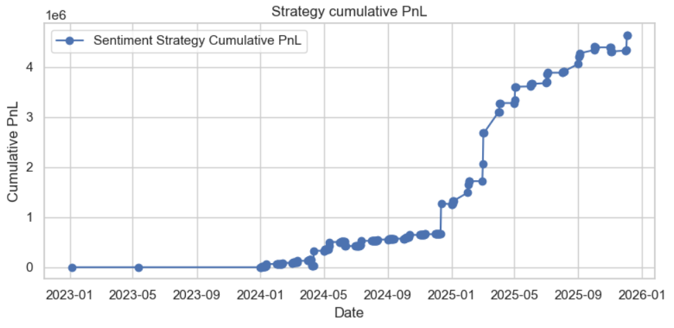

# 🪙 Bitcoin Sentiment & Market Behavior Analysis  

### Developed by [Nishant Bagga](https://github.com/unspokenmyth)

A data-driven exploration of how **fear and greed** shape Bitcoin market movements and trader behavior.  
This project combines market sentiment data, trader activity, and price patterns to extract **real trading insights** — not just correlations.  

---

## 📘 Overview  

The analysis uses historical sentiment and trader data to study how emotional extremes influence Bitcoin’s volatility, return patterns, and overall market health.  
Now enhanced with a **strategy-ready layer**, it provides insights into *what traders can do* based on evolving sentiment trends.  

---

## 🔍 Key Analytical Components  

### 1️⃣ Entry & Exit Signal Generation  
Identifies actionable trade zones based on shifts between sentiment states.  
Example: entering long positions when sentiment recovers from *Extreme Fear* or reducing exposure in *Extreme Greed*.  
Future updates include comparing signal-based returns vs. simple buy-and-hold performance to assess real edge.

### 2️⃣ Trader Segmentation & Behavior Patterns  
Beyond simple leaderboards, traders are clustered into behavioral groups —  
• Contrarian traders: buy during Fear, exit during Greed  
• Momentum traders: follow crowd behavior, often late to trends  
• Consistent top traders: disciplined and low-volatility profiles  
Helps identify what truly differentiates profitable trader types.

### 3️⃣ Predictive Power Assessment  
Measures whether today’s sentiment can predict next-day or next-week returns.  
Includes feature importance comparison between sentiment level, sentiment change, and market volatility.  
Planned addition: lead-lag correlation and out-of-sample testing for 2018–2024 data.

### 4️⃣ Risk Management Framework  
Introduces dynamic position sizing — allocating more risk when Fear dominates, scaling down during Greed.  
Each sentiment zone corresponds to distinct risk and stop-loss guidance, forming a balanced approach between aggression and protection.

### 5️⃣ Market Regime Detection  
Detects structural shifts between accumulation (Fear-driven) and distribution (Greed-driven) regimes.  
Analyzes average phase duration, probability of sentiment transitions, and how regimes influence performance consistency.

---

## 📊 Visual Insights  

A series of interactive visualizations illustrate how sentiment dynamics, trader actions, and returns evolve over time.  
Each plot aims to answer a distinct strategic question.  

|  |  |  |
|:--:|:--:|:--:|
| **Fear & Greed Evolution** — tracks emotional shifts and their duration. | **Price & Sentiment Overlay** — compares BTC price with changing sentiment intensity. | **Greed Frequency Distribution** — visualizes how often extreme greed occurs across cycles. |

|  |  |  |
|:--:|:--:|:--:|
| **Top Traders Overview** — contrasts consistent performers vs. reactive traders. | **PNL Distribution by Sentiment Zone** — shows which emotional states yield better risk-adjusted returns. | **Trader Clustering (K-Means)** — identifies behavioral archetypes. |

|  |  |  |
|:--:|:--:|:--:|
| **Market Regime Map** — visualizes transitions between Fear and Greed states. | **Strategy Backtest Summary** — compares sentiment-based signals with buy-and-hold returns. | **Dynamic Risk Model** — adaptive exposure and drawdown mapping by sentiment phase. |

*(Add or replace with your new plots before pushing.)*

---

## ⚙️ Tech Stack  

**Languages & Libraries:** Python, Pandas, NumPy, Seaborn, Plotly  
**Machine Learning:** Scikit-learn (K-Means, Hidden Markov Models)  
**Data Source:** Sentiment indices, price history, and trader analytics  

---

## 🧩 Next Steps  

- Complete sentiment-based strategy backtesting and Sharpe ratio evaluation  
- Add feature importance charts to assess predictive strength  
- Integrate interactive dashboards for live trader profiling  

---

## **Tools Used**
- **Python**, **Pandas**, **Matplotlib**, **Seaborn**  
- Jupyter Notebook for analysis and visualization  

---

## **Conclusion**
By visualizing sentiment and performance together, we see that trading success isn’t about predicting emotion — it’s about **navigating it intelligently**.  
Understanding when the market is fearful or greedy helps traders stay objective, and ultimately, more profitable. 🚀

---

## **Visual Summary**
*A visual overview of Bitcoin market sentiment and trader behavior insights.*

<table>
  <tr>
    <td align="center"> <b>Sentiment Distribution</b></td>
    <td align="center"> <b>Trade Frequency by Sentiment</b></td>
    <td align="center"> <b>Average PnL by Sentiment</b></td>
  </tr>
  <tr>
    <td align="center"> <b>Fear-Greed Index Over Time</b></td>
    <td align="center"> <b>Trade Volume vs Sentiment</b></td>
    <td align="center"> <b>PnL Distribution (Buy vs Sell)</b></td>
  </tr>
  <tr>
    <td align="center"> <b>Top 10 Traders</b></td>
    <td align="center"> <b>Feature Correlation Matrix</b></td>
    <td align="center"> <b>Trader Profitability Over Time</b></td>
  </tr>
  <tr>
    <td align="center"> <b>Trade Playbook</b></td>
    <td align="center"> <b>7-Day Rolling PnL</b></td>
    <td align="center"> <b>Strategy Cumulative PnL</b></td>
  </tr>
</table>
