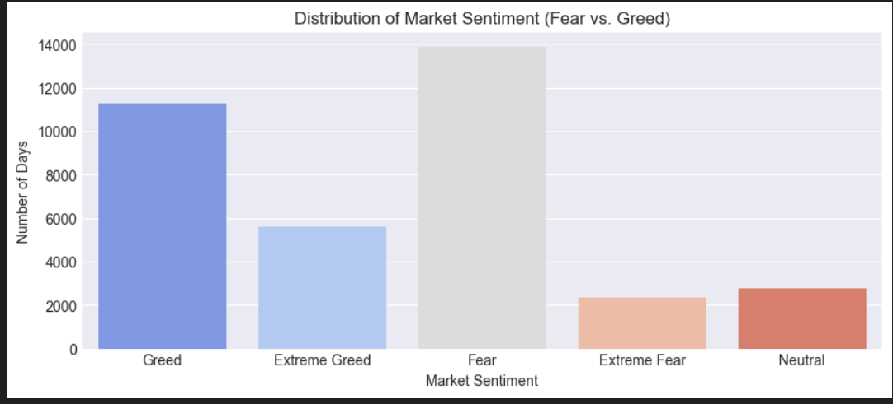
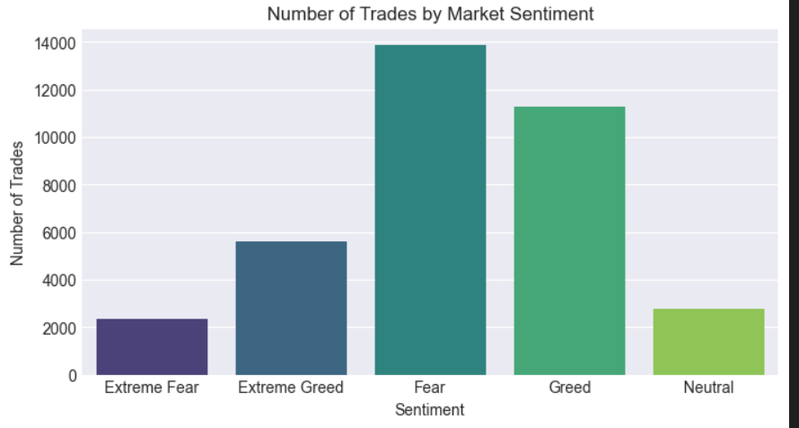
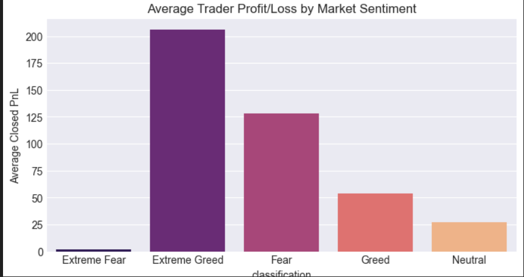
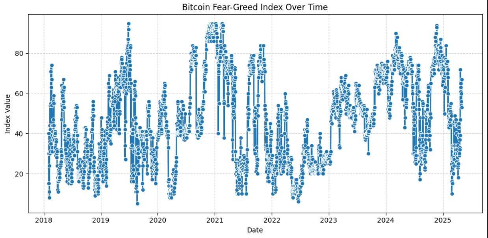
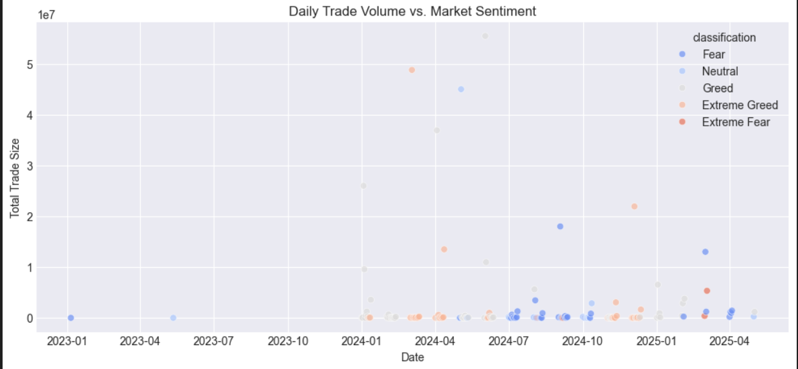
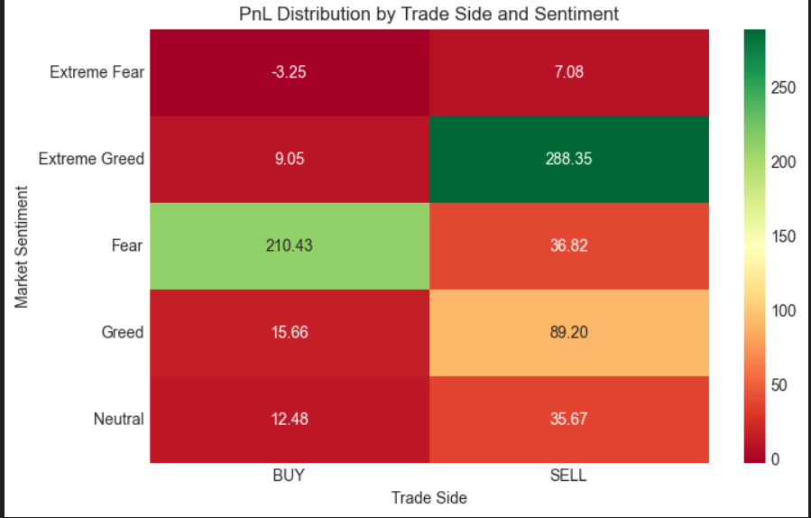
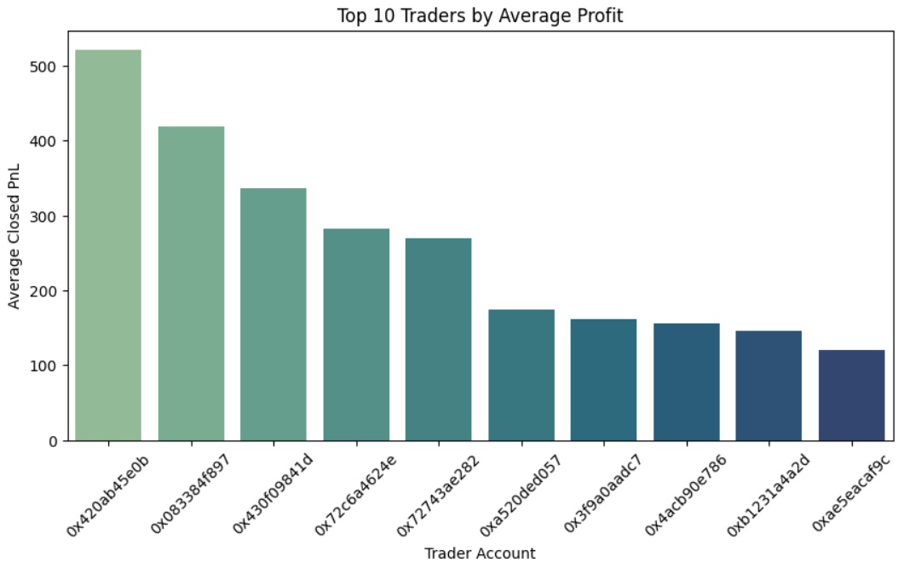
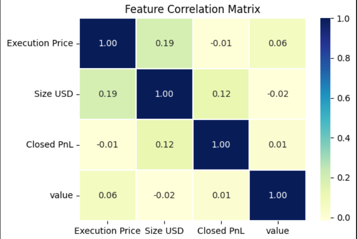
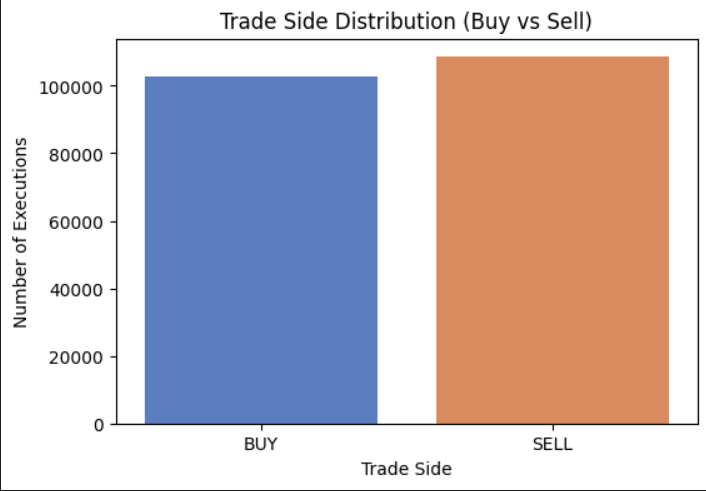

# 📊 Market Sentiment and Trader Performance Analysis

**Author: Nishant Bagga**  

## **Objective**
This project explores how **market sentiment** — fear, greed, and everything in between — influences **trading behavior and profitability**.  
By analyzing performance trends across emotional phases, we uncover how traders react under pressure and when opportunity strikes.

---

## **Dataset Overview**
The dataset includes:
- **Trade Details:** Buy/Sell activity, price, and size  
- **Profit & Loss (PnL):** Realized gains per trader  
- **Market Sentiment:** Ranging from *Extreme Fear* to *Extreme Greed*  
- **Account IDs:** Anonymized trader identifiers (truncated to 10–12 chars)  
- **Date & Index Data:** Tracking sentiment shifts over time  

---

## **Analysis Overview**
1. Sentiment distribution and activity frequency  
2. Trade volume and profit patterns across emotions  
3. Time-based shifts in the Fear-Greed index  
4. Ranking of traders by consistent profitability  
5. Correlation insights between trading metrics  

---

## **Key Visual Insights**

### **1. Market Sentiment Distribution**
- Fear dominates overall market behavior, followed closely by Greed.  
- Suggests a cautious trading environment with short bursts of optimism.  

### **2. Trade Frequency by Sentiment**
- Activity spikes during **Fear** and **Greed** phases — traders are most active when emotions are strongest.  

### **3. Average PnL by Sentiment**
- **Extreme Greed** yields the highest average profit.  
- **Extreme Fear** often correlates with losses or reduced exposure.  

### **4. Fear-Greed Index Over Time**
- Sentiment follows a **cyclical pattern**, shifting with volatility.  
- Traders who adapt to these transitions tend to outperform.  

### **5. Volume vs. Sentiment**
- High trade volumes appear during emotional extremes — fear-driven selloffs or greed-fueled rallies.  

### **6. PnL Distribution (Buy vs. Sell)**
- **BUY** trades perform better during Fear; **SELL** trades dominate during Extreme Greed.  

### **7. Top 10 Traders**
- Consistent profits across conditions — not sentiment-driven but **data-disciplined**.  

### **8. Feature Correlation Matrix**
- Minimal correlation among numeric trade features.  
- Reinforces that **behavioral patterns**, not just size or price, drive outcomes.  

### **9. Trader Profitability Over Time**
- Subtle upward trend among experienced traders.  
- Suggests adaptation and learning curves in market behavior.  

---

## **Key Takeaways 💡**
- Emotions **drive participation**, especially at extremes.  
- **Profit peaks during Greed**, but smart traders exploit Fear cycles.  
- **Consistency beats emotion** — disciplined strategies outperform mood-based reactions.  
- Market sentiment is a **useful signal**, not a trading instruction.

---

## **Tools Used**
- **Python**, **Pandas**, **Matplotlib**, **Seaborn**  
- Jupyter Notebook for analysis and visualization  

---

## **Conclusion**
By visualizing sentiment and performance together, we see that trading success isn’t about predicting emotion — it’s about **navigating it intelligently**.  
Understanding when the market is fearful or greedy helps traders stay objective, and ultimately, more profitable. 🚀

---

## **Visual Summary**
*A visual overview of Bitcoin market sentiment and trader behavior insights.*

<table>
  <tr>
    <td align="center"> <b>Sentiment Distribution</b></td>
    <td align="center"> <b>Trade Frequency by Sentiment</b></td>
    <td align="center"> <b>Average PnL by Sentiment</b></td>
  </tr>
  <tr>
    <td align="center"> <b>Fear-Greed Index Over Time</b></td>
    <td align="center"> <b>Trade Volume vs Sentiment</b></td>
    <td align="center"> <b>PnL Distribution (Buy vs Sell)</b></td>
  </tr>
  <tr>
    <td align="center"> <b>Top 10 Traders</b></td>
    <td align="center"> <b>Feature Correlation Matrix</b></td>
    <td align="center"> <b>Trader Profitability Over Time</b></td>
  </tr>
</table>
